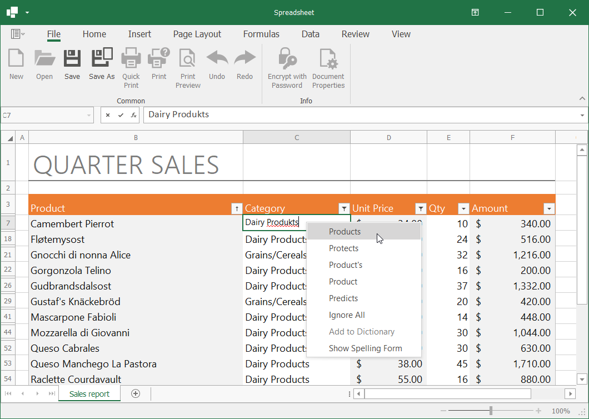

<!-- default badges list -->

[](https://supportcenter.devexpress.com/ticket/details/T1043112)
[](https://docs.devexpress.com/GeneralInformation/403183)
<!-- default badges end -->
# Spreadsheet for WinForms – Spell Check Text in a Cell Editor

This example demonstrates how to use the [DevExpress Spell Checker](https://docs.devexpress.com/WindowsForms/2635/controls-and-libraries/spell-checker) component to check spelling in spreadsheet cells. When a user types text in a cell, the spell checker indicates misspelled words with a red wavy line. The user can right-click an underlined word and select the correct spelling from the list of suggestions or invoke the [Spelling dialog](https://docs.devexpress.com/WindowsForms/8595/controls-and-libraries/spell-checker/visual-elements/spelling-dialog).



This example uses the default English dictionary to check cell text. Refer to the following help topic for information on how to add dictionaries for other languages to the Spell Checker: [Spell Checker Dictionaries](https://docs.devexpress.com/WindowsForms/8581/controls-and-libraries/spell-checker/dictionaries).

## Implementation Details

Follow the steps below to integrate a spell checker into the Spreadsheet application:

1. Register the control used as the default cell editor (the [System.Windows.Forms.TextBox](https://docs.microsoft.com/en-US/dotnet/api/system.windows.forms.textbox) descendant) to enable spell check in spreadsheet cells. See this topic for details: [Check Spelling in Different Controls](https://docs.devexpress.com/WindowsForms/2995/controls-and-libraries/spell-checker/checking-spelling-in-different-controls).

    ```
    SpellCheckTextControllersManager.Default.RegisterClass(typeof(TextBoxWithTransparency),
        typeof(SimpleTextBoxTextController));
    SpellCheckTextBoxBaseFinderManager.Default.RegisterClass(typeof(TextBoxWithTransparency),
        typeof(TextBoxFinder));
    ```

2. Handle the [SpreadsheetControl.CellEditorOpened](https://docs.devexpress.com/WindowsForms/DevExpress.XtraSpreadsheet.SpreadsheetControl.CellEditorOpened) event to access the active cell editor. Use the [SpellChecker.Check](https://docs.devexpress.com/WindowsForms/DevExpress.XtraSpellChecker.SpellChecker.Check(System.Windows.Forms.Control)) method to check text in the editor.

3. Create and display a **Spell Check** context menu for the cell editor, as described in this help topic: [Add a Spell Check Menu to the Standard Text Controls](https://docs.devexpress.com/WindowsForms/114007/controls-and-libraries/spell-checker/examples/how-to-add-spell-check-menu-to-the-standard-text-controls).

<!-- default file list -->
## Files to Look At

- [Form1.cs](./CS/SpreadsheetSpellchecking/Form1.cs) ([Form1.vb](./VB/SpreadsheetSpellchecking/Form1.vb))
<!-- default file list end -->

## More Examples

- [Spreadsheet for WPF – Spell Check Text in a Cell Editor](https://github.com/DevExpress-Examples/wpf-spreadsheet-spell-check-cell-text)
